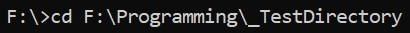
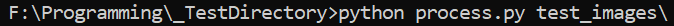

# GenderClassification

Репозиторий для размещения тестового задания от NtechLab.

Описание файлов
1. MaxSubArray.py - содержит функцию findMaxSubArray(A) к первому заданию.
2. GenderClassification_#.ipynb - Jupyter notebooks с шагами по обучению сети
3. process.py - cкрипт для использования нейросети
4. model - папка с tf.model, которую использует скрипт process.py для загрузки модели

Описание модели

В работе

Инструкция по применению сети.
1) Убедитесь, что у вас установлен python с tensorflow версии 2 и выше
2) Скопируйте файл process.py вместе с папкой model в одну директорию.

3) Запустите командную строку и перейдите в директорию с файлами

4) Запустите скрипт указав путь к папке с изображениями

