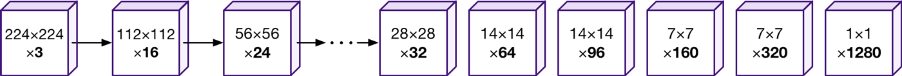

# GenderClassification

Репозиторий для размещения тестового задания от NtechLab.<br/>    
Основная работа - создание модели, которая определяет пол человека по изображению его лица.<br/>  
Основной фреймворк - TensorFlow 2 

## Описание файлов
<details>
  <summary>Раскрыть</summary><br/>
  
  1. MaxSubArray.py - содержит функцию findMaxSubArray(A) к первому заданию.
  2. GenderClassification_#.ipynb - Jupyter notebooks с шагами по обучению сети
  3. process.py - cкрипт для использования нейросети (инструкция ниже)
  4. model.zip - Архив с папкой содержащей tf.model, которую использует скрипт process.py для загрузки модели
  5. train.py - скрипт для обучения нейросети, который создает папку model (инструкция ниже). 
  6. Gender_clf_utils.py - дополнительные функции, используются в Jupyter notebooks
  7. test_images - 5 изображений из тренировочных данных.
  8. requirements.txt - используемые библиотеки
</details>

## Описание хода работы
<details>
  <summary>Раскрыть</summary><br/>  
  Создание классификатора изображений является одной из стандартных задачач машинного обучения.
  Для этих целей лучше всего подходят сверточные нейронные сети (CNN), способные обнаруживать детали на изображениях
  вне зависимости от их расположения.<br/>
  Для создания моделей я использовал TensorFlow 2, так как уже имел опыт работы с этим фреймворком.
  
  Моей целью было достижение точности в 99%.<br/>
  Результат: 98% точности на валидационном сете. <br/>
  Также были обнаружены аномалии в данных, которые препятствуют достижению более высоких результатов. 
  Конечно, подобные аномалии могут встречаться. Но в этом случае определение пола только по лицу 
  не представляется возможным.
  <br/>
  
  Я проводил эксперименты и записывал свои действия в Jupyter notebook. Для вычислений использовалась локальная видеокарта Nvidia 1050ti.
  
  Основные шаги (выполнены в блокнотах 1 и 2):
  
  * Создал план действий (в Notion) для контроля прогресса. Повторил некоторые аспекты теории по обработке изображений, CNN, классификации.
  
  * Подготовка и просмотр данных
  Так как количество изображений велико, я решил не применять дополнительную обработку.
  Изначально планировалась работа в GoogleColab, но загрузка данных часто давала ошибки. Для упрощения чтения я разместил файлы в подпапки, 
  но скорость загрузки изображений была слишком низкой.
  
  * Сформировал датасет с помощью tf.data. Изображения были приведены к единому размеру. Масштаб решил не сохранять, так как 
  после изменения размера, значительных искажений я не обнаружил. <br/>
  Возможно, стоило проверить размеры всех изображений для выявления аномалий, но так как их загрузка занимает довольно 
  много времени, решил пропустить этот шаг. <br/>
  Размер изображений выбран 96х96 для совместимости с обученными моделями tf.hub
  
  * Для получения базовой метрики я применил простую последовательную CNN модель с 4 сверточными и 3 полностью соединенными слоями.
  Во всех моделях используется последний слой с одним нейроном и sigmoid активацией для получения вероятностей принадлежности к классу.
  Loss функция - BinaryCrossentropy. Метрика - accuracy. <br/>
  Модель довольно быстро начала переобучаться и недостаточно хорошо обрабатывала валидационный сет.
  
  
  
  
  
  * Затем я воспользовался обученной моделью MobileNet V2 для извлечения атрибутов изображения. <br/>
  Я выбрал эту архитектуру из-за её эффективности. Для начала я взял самую неглубокую версию с самым малым размером 
  изображения (96х96). Низкая глубина модели обусловлена невысокой сложностью задачи: небольшое количество классов и то, что объект 
  размещен почти на всей картинке. А малый размер изображений выбран потому, что средний размер исходных данных также невелик (множество изображений даже меньше 96х96). 
  
  * К модели были добавлены два слоя - дропаут, для случайного выключения нейронов, что способствует генерализации модели, 
  и последний слой, с одним нейроном и sigmoid активацией. Чтобы не навредить весам загруженной модели, сначала я тренировал только последний слой.
  Затем значительно снизив начальную скорость обучения, разморозил веса всей модели. Я воспользовался 1cycle расписанием обучения, 
  чтобы сперва "разогреть" модель и не допустить разрушения модели из-за высоких градиентов.
  
  
  
  Модель достигла 100% на тренировочном сете, но на валидационном показывала лишь 97%.
  Чтобы побороть подобный оверфит, стандартным решением будет увеличить количество данных. Этого можно достичь путем 
  аугментации изображений. Перед тем как приступить к этому, я провел небольшой анализ ошибок.
  
  * В ходе анализа ошибок я не обнаружил склонности модели к ошибкам в одном или другом классе. Также модель делала подавляющее большинство прогнозов
  с высокой уверенностью. Посмотрев на выборку неверно классифицированных изображений, я сам затруднился определить пол на некоторых из них. 
  Над изображениями подписан предсказанный класс.
 
  
  
  
  
  * Далее (в блокноте 2), чтобы справиться с оверфитом, я добавил аугментацию тренировочного сета.
  Использовав функцию tf.keras.preprocessing.image.ImageDataGenerator, я получал случайно измененные изображения каждую эпоху. 
  Список изменений: Поворот, изменение высоты/ширины, горизонтальное отражение, зум. Фон заполнялся черным цветом.
  
  
  
  
  * Чтобы справится с усложненным датасетом, я увеличил модель, выбрав ту же MobileNet V2, но уже со 100% глубиной.
  Сначала мы обучаем только последний слой 15 эпох. Далее мы размораживаем веса всей модели и продолжаем обучение с очень малой скоростью, постепенно наращивая её.
  После 50 эпох, модель достигла 98.6% точности на тренировочном сете и 98% на валидационном. <br/>
  
  
  
  * С 15 по 40 эпоху, обучение проводилось с оптимизатором RMSprop и 1cycle расписанием обучения. Последние 10 эпох использовали оптимизатор Адам на фиксированной скорости.
  Этот подход показывает более плавный прогресс и в финальной версии я использую оптимизатор Адам с расписанием плавно растущим (10 эпох) до неизменного.
  
  * Вновь ознакомившись с ошибками, я решил удостоверится, точно ли они относятся к правильному классу и находятся ли в верной папке.
  Как оказалось, в потоке данных ошибок не было, но возможно, что при разметке они всё же были допущены. Я полагаю, что эти недочеты в
  данных не позволили модели достигнуть желаемых 99%. <br/>
  На данной картинке изображены только мужчины.
  
  
  
  * Последним шагом был эксперимент с аугментацией валидационного сета. Я применил несколько последовательных модификаций к каждому изображению
  (обрезка, растягивание) и делал прогноз на каждом из них. Затем я попробовал либо усреднить прогноз, либо провести голосование. Оба метода не привели
  к увеличению точности.
  
</details>  
  
## Описание итоговой модели
<details>
  <summary>Раскрыть</summary><br/>  
  В основе лежит модель MobileNetV2 обученная на Imagenet2012 датасете.<br/>
  Данная версия имеет параметр глубины - 1 и входной размер изображений - 96х96
  Основная идея MobileNet архитектуры - заменить ресурсозатратные сверточные слои на более дешевые, хоть и увеличивая их количество.
  Мы можем заметить, что по мере прохождения данных через сеть, количество каналов остается небольшим. <br/>
  
  

  Первый слой модели это обычный сверточный слой, затем следуют BottleneckResidual блоки. В конце идут два сверточных слоя с AvgPooling между ними.
  В блоках первый слой увеличивает количество каналов, следующий слой проводит вычисления вдоль измерения каналов, 
  и далее последний слой уменьшает их количество, проецируя данные обратно в исходное измерение. Важно заметить, что каждый блок также имеет 
  пропускное соединение, то есть на выходе из блока мы получаем и обработанные, и исходные данные.
  
  
  
  Полный вид модели. Размеры указаны для исходных изображений 224х224.
  
  
  
  Затем, использовав MobileNetV2 для извлечения атрибутов из изображения, я добавил дропаут слой с 20%, который случайно отключает 20% нейронов во время обучения,
  что вынуждает большее количество нейронов извлекать полезные атрибуты. Завершает модель полностью соединенный слой с одним нейроном и сигмоид активацией. Он возвращает
  одно число для каждого изображения, которое отражает вероятность принадлежности к одному или другому классу.
  
  Функция потерь - binary crossentropy. Основная метрика - accuracy.
  
  Тренировочные данные перед обработкой аугментируются случайным образом (повороты, растяжения, обрезания). Модель обучалась на 100000 изображениях лиц.
  Точность модели приближается к 99%.
  
  Тренировка модели проходит в два этапа. Сначала тренируется только верхний слой в течении 10 эпох. Используемый оптимизатор - SGD с моментумом.
  Затем веса загруженной части модели размораживаются и тренируется вся модель. На этом этапе используется оптимизатор Adam. Начальная скорость обучения
  значительно снижена, чтобы не навредить точно настроенным весам модели, и возрастает в течении 10 эпох, далее остается неизменной. Тренировка всей модели должна
  продолжаться хотя бы 40 эпох.
  
  
</details>

## Инструкция по применению сети
<details>
  <summary>Раскрыть</summary><br/> 
  
  1) Убедитесь, что у вас установлен python с tensorflow версии 2 и выше
  2) Скопируйте файл process.py вместе с папкой model в одну директорию. Можете разместить изображения в эту же папку.

  

  3) Запустите командную строку и перейдите в директорию с файлами. 

  ```
  - > cd f:\my_folder_with_files
  ```

  4) Запустите скрипт, указав путь к папке с изображениями.

  ```
  - > python process.py path/to/images
  ```

  5) После выполнения, в папке со скриптом появится новый файл process_results.json. В нем будут размещены результаты
  в виде { ‘img_1.jpg’: ‘male’, ‘img_2.jpg’: ‘female’, ...}
  </details>
  
## Инструкция по обучению сети
<details>
  <summary>Раскрыть</summary><br/>  
  1) Убедитесь, что у вас установлен tensorflow gpu и tf.hub
  2) Разместите файл train.py в отдельной папке. Также подготовьте папки с изображениями. Классы должны находиться в разных папках.
  
  
  
  3) Запустите командную строку и перейдите в директорию с файлом. 
  
  ```
  - > cd f:\my_folder
  ```
  
  4) Запустите скрипт. Если изображения находятся в другой папке, укажите путь.
   ```
  - > python train.py f:\my_image_data
  ```
  5) После 50 эпох обучения модель будет сохранена в папку model и может быть использована посредством скрипта process.py.
  Также будет сохранен history файл, содержащий словарь с loss и accuracy по каждой эпохе (h = np.load(history.npy, allow_pickle=True).
  
</details>
